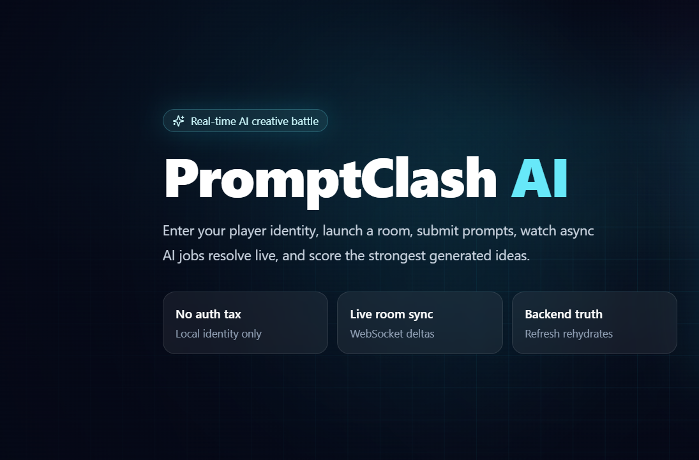

# PromptClash AI

<p align="center">
  
</p>

<p align="center">
  <strong>Real-time AI Creative Battle Room</strong><br>
  Create rooms • Battle with prompts • Generate AI outputs asynchronously • Score submissions • Eliminate participants • Persist state across refreshes
</p>

---

## Overview

PromptClash AI is a real-time multiplayer AI battle room where a Host creates a challenge, Participants compete using prompts, AI generation runs asynchronously in the background, and the Host scores or eliminates submissions while all connected users remain synchronized through WebSockets.

The project focuses on building one complete and correct product loop instead of many partially implemented features.

---

## Demo Flow

```text
Identity
    ↓
Create / Join Room
    ↓
Start Round
    ↓
Submit Prompt
    ↓
Generation Job
(Queued → Running → Completed)
    ↓
Score Submission
    ↓
Eliminate Participant
    ↓
Persistent Recovery
```

---

## Tech Stack

<table>
<tr>
<td width="50%" valign="top">

### Frontend

| Technology    | Purpose               |
| ------------- | --------------------- |
| Next.js 15    | Application Framework |
| TypeScript    | Type Safety           |
| Tailwind CSS  | Styling               |
| Zustand       | State Management      |
| Framer Motion | Animations            |
| Lucide React  | Icons                 |

</td>

<td width="50%" valign="top">

### Backend

| Technology                | Purpose                  |
| ------------------------- | ------------------------ |
| FastAPI                   | API Framework            |
| SQLAlchemy                | ORM                      |
| SQLite                    | Database                 |
| WebSockets                | Realtime Synchronization |
| asyncio Workers           | Async Processing         |
| Mock / Anthropic Provider | AI Generation            |

</td>
</tr>
</table>

---

## Key Features

| Feature                  | Status |
| ------------------------ | ------ |
| Persistent Identity      | ✅      |
| Room Creation            | ✅      |
| Multiplayer Join         | ✅      |
| Round Management         | ✅      |
| Realtime Synchronization | ✅      |
| Async AI Generation      | ✅      |
| Job Lifecycle Tracking   | ✅      |
| Host Scoring             | ✅      |
| Participant Elimination  | ✅      |
| Refresh Recovery         | ✅      |

---

## Architecture

```text
┌─────────────────────┐
│      Frontend       │
│  Next.js + Zustand  │
└──────────┬──────────┘
           │
     REST + WebSocket
           │
           ▼
┌─────────────────────┐
│       FastAPI       │
│   Business Logic    │
└───────┬─────┬───────┘
        │     │
        │     │
        ▼     ▼
    SQLite  WebSockets
        │
        ▼
 Async Job Worker
        │
        ▼
   AI Provider
```

---

## Core Workflow

### 1. Identity

Users enter a name and email.

The frontend calls:

```http
POST /identity
```

The backend creates or restores the user and returns a persistent user ID.

---

### 2. Room Creation

The Host creates a room.

```http
POST /rooms
```

The creator automatically becomes the Host.

---

### 3. Room Join

Participants join using a room code.

```http
POST /rooms/{code}/join
```

Joined users appear instantly through WebSocket updates.

---

### 4. Round Management

Hosts create and start rounds.

```http
POST /rooms/{code}/rounds
PATCH /rooms/{code}/rounds/{round_id}/start
```

---

### 5. Prompt Submission

Participants submit prompts.

```http
POST /rounds/{round_id}/submissions
```

The request returns immediately after saving the submission and generation job.

---

### 6. Async Generation

Background workers process jobs independently.

```text
Submission
    ↓
Generation Job
    ↓
AI Output
```

No long-running generation blocks active users.

---

### 7. Judging

Hosts can:

* Score submissions
* Eliminate participants

Scores update instantly across all connected clients.

---

## Generation Job Lifecycle

```text
Prompt Submitted
        │
        ▼
     QUEUED
        │
        ▼
     RUNNING
        │
   ┌────┴────┐
   ▼         ▼
COMPLETED  FAILED
               │
               ▼
           TIMED_OUT
```

Every state transition is broadcast through WebSockets.

---

## Realtime Event Model

The room synchronizes through typed WebSocket events:

| Event                   |
| ----------------------- |
| room.participant_joined |
| room.participant_left   |
| round.created           |
| round.started           |
| round.closed            |
| submission.created      |
| submission.scored       |
| participant.eliminated  |
| job.queued              |
| job.running             |
| job.completed           |
| job.failed              |
| job.timed_out           |

The frontend hydrates state from the backend snapshot first and then applies realtime event deltas.

---

## Permission Model

| Action                | Host | Participant |
| --------------------- | ---- | ----------- |
| Create Room           | ✅    | ❌           |
| Start Round           | ✅    | ❌           |
| Close Round           | ✅    | ❌           |
| Submit Prompt         | ❌    | ✅           |
| Score Submission      | ✅    | ❌           |
| Eliminate Participant | ✅    | ❌           |
| Join Room             | ❌    | ✅           |

All permissions are enforced on the backend.

---

## Persistence Strategy

The following survive refreshes and reconnects:

| Data          | Persisted |
| ------------- | --------- |
| User Identity | ✅         |
| Rooms         | ✅         |
| Participants  | ✅         |
| Rounds        | ✅         |
| Submissions   | ✅         |
| Job Status    | ✅         |
| Scores        | ✅         |
| Eliminations  | ✅         |

State is restored from SQLite and synchronized through WebSockets.

---

## Design Decisions

| Decision              | Reason                                                 |
| --------------------- | ------------------------------------------------------ |
| SQLite                | Fast local setup and simple persistence                |
| Mock Identity         | Focus on assignment workflow instead of authentication |
| Async Workers         | Prevent blocking request handling                      |
| WebSockets            | Realtime collaboration                                 |
| Single Vertical Slice | Complete product loop instead of unfinished features   |
| Mock AI Provider      | Demo works without external credentials                |

---

## Local Setup

### Backend

```bash
cd backend
python -m venv venv
venv\Scripts\activate
pip install -r requirements.txt
cd ..
uvicorn backend.main:app --reload --port 8000
```

### Frontend

```bash
cd frontend
npm install
npm run dev
```

### URLs

| Service  | URL                        |
| -------- | -------------------------- |
| Frontend | http://localhost:3000      |
| Backend  | http://127.0.0.1:8000      |
| API Docs | http://127.0.0.1:8000/docs |

---

## Environment Variables

See `.env.example`.

| Variable                 | Purpose               |
| ------------------------ | --------------------- |
| NEXT_PUBLIC_API_BASE_URL | Frontend API URL      |
| PROVIDER                 | AI Provider Selection |
| JOB_CONCURRENCY          | Worker Concurrency    |
| JOB_TIMEOUT_SECS         | Job Timeout           |
| JOB_MAX_RETRIES          | Retry Count           |
| JOB_POLL_SECS            | Worker Poll Interval  |
| ANTHROPIC_API_KEY        | Anthropic Credentials |
| AI_MODEL                 | Model Selection       |

---

## Future Improvements

* PostgreSQL
* Redis-backed Workers
* Distributed WebSocket Delivery
* AI-Assisted Judging
* Tournament Mode
* OAuth / JWT Authentication
* Automated Integration Tests
* Production Deployment Infrastructure
* Moderation Layer
* Reconnect Delta Recovery

---

## Assignment Requirements Covered

✅ Identity Creation

✅ Room Creation

✅ Room Joining

✅ Realtime Collaboration

✅ Round Management

✅ Asynchronous AI Generation

✅ Job Lifecycle Tracking

✅ Host Scoring

✅ Participant Elimination

✅ Persistent State Recovery
